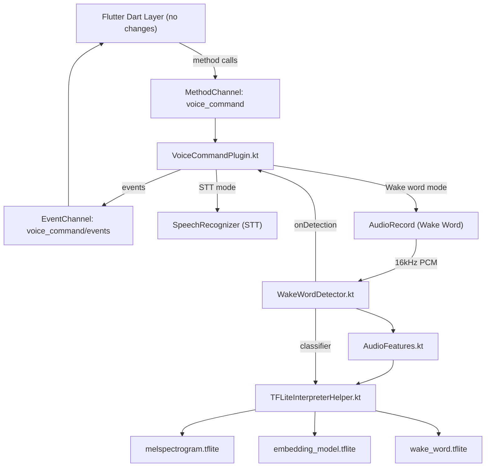

# Android Wake Word Detection + STT Integration

## Current State

**iOS (complete):** Full 3-stage TFLite wake word pipeline (`melspectrogram.tflite` -> `embedding_model.tflite` -> `wake_word.tflite`) with STT via `SFSpeechRecognizer`. Wake word and STT are mutually exclusive, sharing a single `AVAudioEngine`.

**Android (partial):** STT via `SpeechRecognizer` is implemented with debounce, session flush, pause/resume. **Missing entirely:** wake word detection, `reapplyAudioSession`, `startWakeWordDetection`, `stopWakeWordDetection`, `isWakeWordActive`.

**Dart layer (complete):** All method channel calls and event types are already defined. No Dart changes needed.

## Architecture

## Key Differences from iOS

| Aspect                    | iOS                                                 | Android                                                          |
| ------------------------- | --------------------------------------------------- | ---------------------------------------------------------------- |
| Audio capture (wake word) | `AVAudioEngine` tap + `AVAudioConverter` resampling | `AudioRecord` at native 16kHz mono -- no resampling needed       |
| STT engine                | `SFSpeechRecognizer`                                | `SpeechRecognizer` (already implemented)                         |
| TFLite library            | `TensorFlowLiteSwift` (CocoaPods)                   | `tensorflow-lite` (Maven/Gradle)                                 |
| Model bundling            | Plugin resource bundle (`voice_command_wakeword`)   | Flutter asset lookup via `FlutterLoader`                         |
| Audio session             | `AVAudioSession` configuration                      | No equivalent needed (Android manages audio focus automatically) |
| Threading                 | `DispatchQueue` for inference                       | Kotlin coroutine or dedicated `HandlerThread`                    |

## Files to Create

### 1. `TFLiteInterpreterHelper.kt`

- **Path:** `android/src/main/kotlin/com/example/voice_command/TFLiteInterpreterHelper.kt`
- Port of [ios/Classes/TFLiteInterpreterHelper.swift](ios/Classes/TFLiteInterpreterHelper.swift)
- Wraps `org.tensorflow.lite.Interpreter`
- Methods: `resizeInput(index, shape)`, `copyInput(byteBuffer, index)`, `invoke()`, `outputFloats(index)`
- Loads model from file path using `Interpreter(File(modelPath))`
- Caches current input shape to skip redundant `resizeInput` calls

### 2. `AudioFeatures.kt`

- **Path:** `android/src/main/kotlin/com/example/voice_command/AudioFeatures.kt`
- Port of [ios/Classes/AudioFeatures.swift](ios/Classes/AudioFeatures.swift)
- Same constants: `frameSize=1280`, `rawOverlap=480`, `melBins=32`, `melWindow=76`, `embeddingDim=96`, `embeddingDepth=16`
- Same pipeline: raw audio -> mel spectrogram -> `x/10+2` transform -> embedding model -> 96-dim embedding
- Uses `ByteBuffer.allocateDirect()` + `ByteOrder.nativeOrder()` for TFLite input data
- `processAudioChunk(samples: FloatArray): Boolean` -- returns true when new embedding produced
- `reset()` to clear all buffers

### 3. `WakeWordDetector.kt`

- **Path:** `android/src/main/kotlin/com/example/voice_command/WakeWordDetector.kt`
- Port of [ios/Classes/WakeWordDetector.swift](ios/Classes/WakeWordDetector.swift)
- 3-stage pipeline: accumulate 1280 samples -> `AudioFeatures.processAudioChunk()` -> flatten 16x96 embeddings -> classifier inference
- Skip first 5 frames (model warm-up)
- 2-second cooldown between detections
- Inference on a dedicated `HandlerThread` (or Kotlin coroutine dispatcher)
- `onDetection: ((Float) -> Unit)?` callback, posted to main thread via `Handler(Looper.getMainLooper())`
- `processAudio(samples: FloatArray)` -- feeds audio, internally accumulates into 1280-sample chunks
- `reset()` and `close()` for cleanup

## Files to Modify

### 4. `build.gradle` -- Add TFLite dependency

- **Path:** [android/build.gradle](android/build.gradle)
- Add `implementation("org.tensorflow:tensorflow-lite:2.16.1")` to dependencies
- Add `aaptOptions { noCompress "tflite" }` to the `android` block so model files are not compressed in the APK

### 5. `VoiceCommandPlugin.kt` -- Add wake word + reapplyAudioSession

- **Path:** [android/src/main/kotlin/com/example/voice_command/VoiceCommandPlugin.kt](android/src/main/kotlin/com/example/voice_command/VoiceCommandPlugin.kt)

Changes:

**a) New state fields:**

- `isWakeWordActive: Boolean`
- `wakeWordDetector: WakeWordDetector?`
- `audioRecord: AudioRecord?`
- `wakeWordThread: Thread?` (audio capture loop)

**b) Method dispatch -- add to `onMethodCall`:**

- `"reapplyAudioSession"` -> restart SpeechRecognizer pipeline (stop + start)
- `"startWakeWordDetection"` -> parse args (`modelPath`, `threshold`, `inputSize`), call `startWakeWordDetection()`
- `"stopWakeWordDetection"` -> call `stopWakeWordDetection()`
- `"isWakeWordActive"` -> return `isWakeWordActive`

**c) `startWakeWordDetection()` implementation:**

1. Guard: not already active
2. If STT is listening, tear it down first (mutual exclusivity)
3. Resolve model paths (from Flutter assets via `FlutterLoader.getLookupKeyForAsset()`, or from absolute path)
4. Create `WakeWordDetector` with mel/embedding/classifier model paths
5. Set `onDetection` callback -> `sendEvent("wakeWordDetected")`
6. Start `AudioRecord` at 16kHz, mono, 16-bit PCM
7. Launch background thread that reads from `AudioRecord` in a loop, converts `ShortArray` to `FloatArray` (divide by 32768), and feeds to `wakeWordDetector.processAudio()`
8. Set `isWakeWordActive = true`
9. Send `"wakeWordListeningStarted"` event

**d) `stopWakeWordDetection()` implementation:**

1. Stop and release `AudioRecord`
2. Stop background audio thread
3. Close `WakeWordDetector`
4. Set `isWakeWordActive = false`
5. Send `"wakeWordListeningStopped"` event

**e) `startListening()` modification:**

- Add at the beginning: if `isWakeWordActive`, call `stopWakeWordEngine()` first (transition from wake word to STT, mirroring iOS behavior)

**f) `reapplyAudioSession()` implementation:**

- If currently listening and not paused: cancel current recognizer, restart it (equivalent of iOS `rebuildPipeline`)
- If wake word is active: stop and restart the AudioRecord + WakeWordDetector pipeline

**g) `tearDown()` modification:**

- Also stop wake word engine if active (release `AudioRecord`, close detector, stop thread)

**h) Model path resolution:**

- Use `flutterPluginBinding.flutterAssets.getAssetFilePathByName(path)` to resolve Flutter asset paths
- Fall back to treating the path as an absolute file path
- For bundled models (mel/embedding/wake_word), look up from Flutter assets using known asset keys

### 6. `AndroidManifest.xml` -- No changes needed

- `RECORD_AUDIO` permission is already declared, which covers both `SpeechRecognizer` and `AudioRecord`

## Model Distribution Strategy

The three `.tflite` model files (`melspectrogram.tflite`, `embedding_model.tflite`, `wake_word.tflite`) are currently in `ios/Resources/`. For Android:

- The host app should declare these as Flutter assets in its `pubspec.yaml`
- The plugin resolves them at runtime using `FlutterLoader.getLookupKeyForAsset()`
- Copy from asset input stream to a temp file (TFLite `Interpreter` requires a `File` path or `MappedByteBuffer`)
- Cache the temp files so they are only copied once per app session
- Alternatively, support an explicit `modelPath` argument (absolute path) for custom models

## Event Parity

After implementation, Android will emit all the same events as iOS:

- `wakeWordDetected` -- when wake word score exceeds threshold
- `wakeWordListeningStarted` -- when wake word pipeline starts
- `wakeWordListeningStopped` -- when wake word pipeline stops
- All existing STT events remain unchanged

## Testing Considerations

- Test wake word detection with the same .tflite models used on iOS
- Test transition: wake word detected -> STT starts -> result received -> back to wake word
- Test mutual exclusivity: starting STT while wake word is active (and vice versa)
- Test `reapplyAudioSession` during active listening
- Test edge cases: permission denied, models not found, device without microphone

